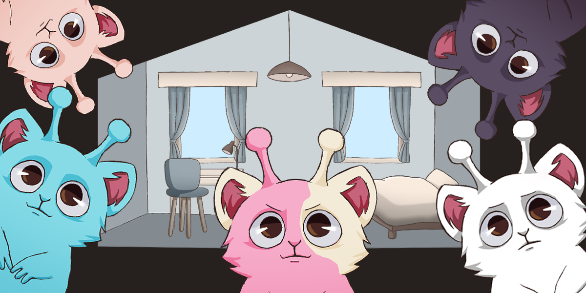
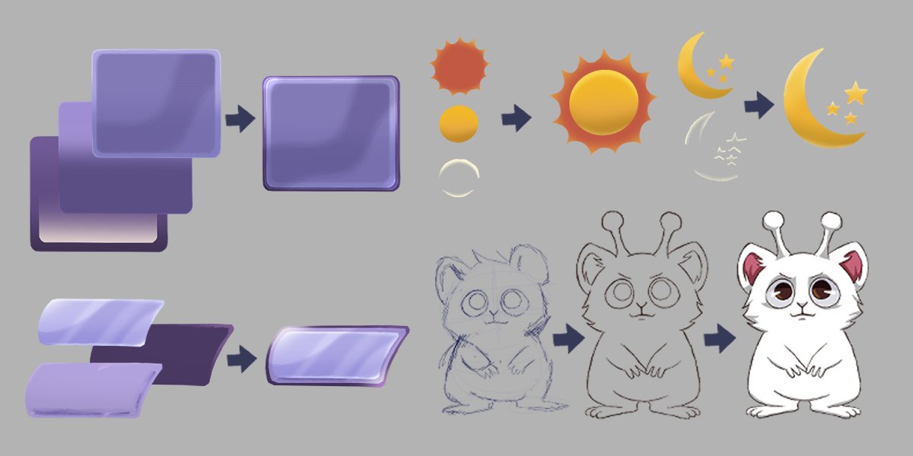
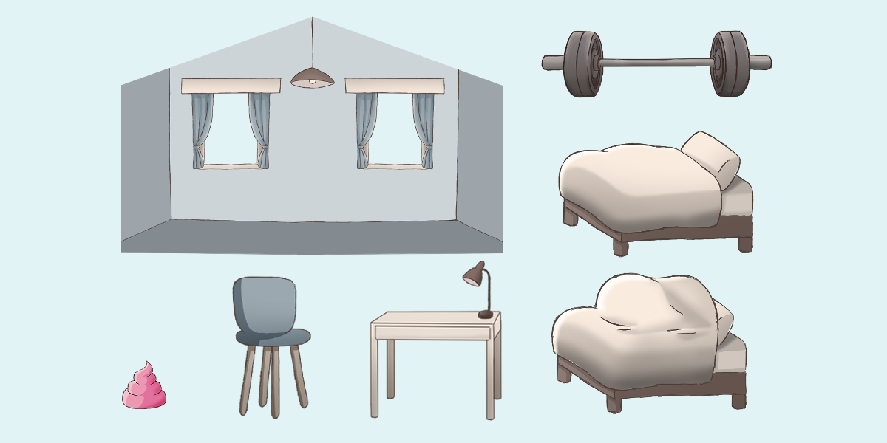

**Hamsteroids game (demo)**

This repository contains a Unity-based game demo exploring a hybrid design inspired by Tamagotchi-style virtual pet systems and SimCity-like simulation concepts. The current build focuses on behavior training rather than full city simulation, serving as a technical prototype for the underlying idea.

The player interacts with an alien hamster and guides its behavior by reinforcing daily routines such as eating, playing, resting, studying, and exercising. These interactions influence the agent’s internal state and habit formation over time.

The demo integrates Neocortex AI tools through an in-game chatbox to support adaptive behavior and experimentation with AI-driven interaction. This project was developed during the Supercell Global AI Hackathon over a single weekend.

_______________________________________________________________________________

**Demo video:**

[Watch the demo video](https://www.youtube.com/watch?v=VIDEO_ID)

_______________________________________________________________________________

**Concept art**

